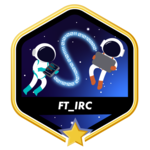

  

<table align="center">
  <tr>
    <td>
      
    </td>
    <td>
      
    </td>
  </tr>
</table>

  
  
  
  
  
  
  
  
  
  
  
  
  
  

<h2 align="center">42 CommonCore </h2>

<table align="center">
  <tr>
    <td height="80" width="80">
      
    </td>
    <td>
      <h3 align="center"><a href="http://github.com/GGwagons/Libft">Libft</a></h3 align="center">
    </td>
    <td height="80" width="80">
      
    </td>
    <td>
      <h3 align="center"><a href="http://github.com/GGwagons/ft_printf">ft_printf</a></h3 align="center">
    </td>
    <td height="80" width="80">
      
    </td>
    <td>
      <h3 align="center"><a href="http://github.com/GGwagons/get_next_line">get_next_line</a></h3 align="center">
    </td>
  </tr>
<!--  -->
  <tr>
    <td height="80" width="80">
      
    </td>
    <td>
      <h3 align="center"><a href="http://github.com/GGwagons/minitalk">minitalk</a></h3 align="center">
    </td>
    <td height="80" width="80">
      
    </td>
    <td>
      <h3 align="center"><a href="http://github.com/GGwagons/Fract-ol">Fract-ol</a></h3 align="center">
    </td>
    <td height="80" width="80">
      
    </td>
    <td>
      <h3 align="center" ><a href="http://github.com/GGwagons/push_swap">push_swap</a></h3 align="center">
    </td>
  </tr>
  <!--  -->
  <tr>
    <td height="80" width="80">
      
    </td>
    <td>
      <h3 align="center"><a href="http://github.com/GGwagons/Philosophers">Philosophers</a></h3 align="center">
    </td>
    <td height="80" width="80">
      
    </td>
    <td>
      <h3 align="center"><a href="http://github.com/GGwagons/Minishell">Minishell</a></h3 align="center">
    </td>
    <td height="80" width="80">
      
    </td>
    <td>
      <h3 align="center"><a href="http://github.com/GGwagons/NetPractice">NetPractice</a></h3 align="center">
    </td>
  </tr>
    <!--  -->
  <tr>
    <td height="80" width="80">
      
    </td>
    <td>
      <h3 align="center"><a href="http://github.com/GGwagons/cub3D">Cub3D</a></h3 align="center">
    </td>
    <td height="80" width="80">
      
    </td>
    <td>
      <h3 align="center"><a href="http://github.com/GGwagons/CPP">C++</a></h3 align="center">
    </td>
    <td height="80" width="80">
      
    </td>
    <td>
      <h3 align="center"><a href="http://github.com/GGwagons/Inception">Inception</a></h3>
    </td>
  </tr>
  <tr>
    <td height="80" width="80">
      
    </td>
    <td>
      <h3 align="center"> <a href="https://github.com/GGwagons/IRC">ft_irc</a></h3>
    </td>
        <td height="80" width="80">
      
    </td>
    <td>
      <h3 align="center"> <a href="https://github.com/GGwagons/ft_transcendence">ft_transcendence</a></h3>
    </td>
    <td></td>
    <td></td>
  </tr>
</table>

#

<h2 align="center">PYTHON</h2>
<table style="owerflow:hidden;" align="center">
  <tr>
    <td>
      <h3 align="center"><a href="https://github.com/GGwagons/Python/tree/main/Guess_The_Number">Guess_The_Number</a></h3>
    </td>
    <td>
      <h3 align="center"><a href="https://github.com/GGwagons/Python/tree/main/Auto_Login">Auto_Login</a></h3>
    </td>
  </tr>
</table>

#

<h2 align="center">BASH</h2>
<h4>----> Coming Soon</h4>

<!--
**GGwagons/ggwagons** is a ✨ _special_ ✨ repository because its `README.md` (this file) appears on your GitHub profile.

Here are some ideas to get you started:

- 🔭 I’m currently working on ...
- 🌱 I’m currently learning ...
- 👯 I’m looking to collaborate on ...
- 🤔 I’m looking for help with ...
- 💬 Ask me about ...
- 📫 How to reach me: ...
- ⚡ Fun fact: ...
-->
